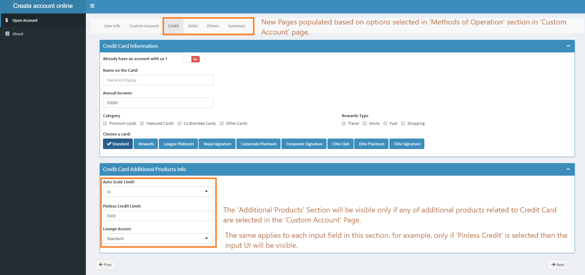
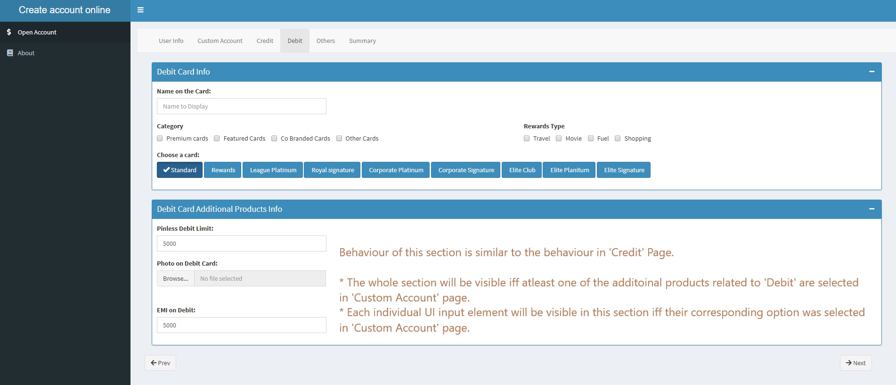
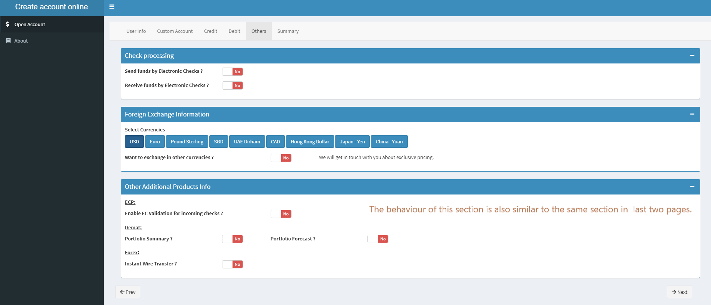

# Open-Bank-Account-Online
This is a sample app/web-tool that can be used by commercial banks for easy on-boarding of their customers. This app is equipped with all the features that are required for a full blown app. 

Clone & run the app in R for a more clear understanding.

## Home Page

### Home Page - Standard Account

### Home Page - Custom Account

Only the products that are related to the Method of payment selected in top section are enabled in the below section.
Conditionally enable Radio Button Options:
1. The options 'Smart Insights', 'Fraud Filter', 'Fraud Insurance' are always enabled
2. The options 'Auto Scale Limit', 'Pinless Credit Payment' are enabled only when 'Credit' option is selected in First Section.
3. The options 'Pinless Debit Payment', 'Photo Debit Card', 'EMI on Debit'  are  enabled only when 'Debit' option is selected in First Section.
4. The options 'ECP Verification' is enabled only when 'ECP' option is selected in First Section.
5. The options 'Portfolio Assistant', 'Instant Payment to World Markets' are enabled only when 'Demat' option is selected in First Section
6. The options 'Multi-Currency Acceptance' is enabled only when 'Forex' option is selected in First Section

This was possible by using:
1. Observe function in Shiny Package
2. Enable/ Disable in ShinyJS Package
3. UpdateInput functions in Shiny Package

--------
##### **Note about Page Navigation:**

The next page to be loaded will be decided on the runtime based on the options selected.
For example, in the below image 'Credit Card', we can see the tabs 'Credit', 'Debit', 'Others' that are being displayed.
These pages will be displayed based on the selection we did in the 'Home Page - Custom'.
* If we selected only 'Credit', then only the 'Credit' page is shown in the nav bar.
* If we select 'Credit' & 'Debit', then both 'Credit' & 'Debit' pages are shown	 in the nav bar.

This is achieved by using JS selectors & functions(showElement/ hideElement) available in shinyjs.

------
### Credit Card

### Debit Card

### Others

