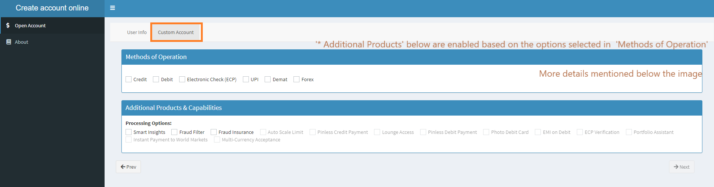

# Open-Bank-Account-Online
Sample app(created in R Shiny) to create online bank account

### Home Page

### Products Selection Page

Only the products that are related to the Method of payment selected in top section are enabled in the below section.
Conditionally enable Radio Button Options:
1. The options 'Smart Insights', 'Fraud Filter', 'Fraud Insurance' are always enabled
2. The options 'Auto Scale Limit', 'Pinless Credit Payment' are enabled only when 'Credit' option is selected in First Section.
3. The options 'Pinless Debit Payment', 'Photo Debit Card', 'EMI on Debit'  are  enabled only when 'Debit' option is selected in First Section.
4. The options 'ECP Verification' is enabled only when 'ECP' option is selected in First Section.
5. The options 'Portfolio Assistant', 'Instant Payment to World Markets' are enabled only when 'Demat' option is selected in First Section
6. The options 'Multi-Currency Acceptance' is enabled only when 'Forex' option is selected in First Section

This was possible by using:
1. Observe function in Shiny Package
2. Enable/ Disable in ShinyJS Package
3. UpdateInput functions in Shiny Package

### Credit Card

